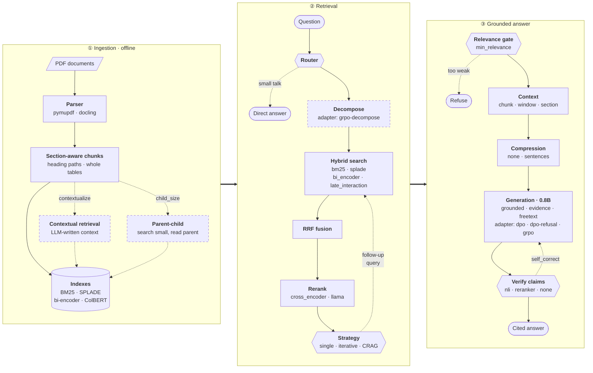

# localrag

**Accurate, cited answers from a 0.8B model, fully local.**
A RAG system over PDFs where every claim cites its source and is checked against it. It runs on one consumer GPU (RTX 5070 Ti), and every design choice is backed by an ablation on held-out questions.

Demo corpus: public FDA medical-device regulations (21 CFR 820, software validation, OTS software, cybersecurity, AI/ML SaMD).

## Results

Held-out test set: 168 questions (single-hop, multi-hop, unanswerable). *Faithful* = share of claims supported by the passage they cite.

| | correct | faithful | refuses unanswerable | false refusals |
|---|---|---|---|---|
| Original prototype (prompt-only citations) | 0.81 | 0.12 | 0% | 0% |
| Default pipeline | 0.78 | 0.90 | 6% | 0% |
| **+ DPO adapter** | **0.91** | **0.98** | 0% | 0% |
| **+ DPO-refusal adapter** | 0.83 | 0.94 | **100%** | 8% |

All 32 variants, with 95% confidence intervals: [`eval/results/summary.md`](eval/results/summary.md)

## Quickstart

```bash
conda create -n rag -c conda-forge python=3.12 "llama.cpp=*=cuda130*"
conda activate rag
pip install torch --index-url https://download.pytorch.org/whl/cu130
pip install -r requirements.txt            # + requirements-rl.txt for training

python -m localrag ingest                  # index documents/*.pdf
python -m localrag ask "What must design verification confirm?" --trace
```

Or open [`demo.ipynb`](demo.ipynb), where every option below is a parameter.

## How it works



<sub>Each box lists its options, default first (see [Options](#options)). Dashed boxes and arrows are optional stages and loops.</sub>

- **Grounded generation.** The model outputs JSON claims. Each citation must be the number of a passage actually shown, and llama.cpp's grammar enforces this, so even a 0.8B model can't cite a source that doesn't exist.
- **Verification.** An NLI model checks every claim against its cited passages. Unsupported claims are dropped.
- **Built from scratch:** the PDF parser, chunker, BM25, SPLADE index, ColBERT MaxSim, RRF fusion, agents, reward functions and evaluation. Libraries handle only inference (llama.cpp), model loading (sentence-transformers), vector storage (Chroma) and training (TRL, PEFT).

## Options

Set in [`configs/default.yaml`](configs/default.yaml) or per command: `python -m localrag --set agent.verifier=nli ask "..."`

| Stage | Parameter | Options (default first) |
|---|---|---|
| Parser | `ingest.parser` | `pymupdf` · `docling` |
| Sparse | `retrieval.sparse` | `bm25` · `splade` |
| Dense | `retrieval.dense_backend` | `bi_encoder` · `late_interaction` |
| Reranker | `retrieval.reranker_backend` | `cross_encoder` · `llama` |
| Retrieval | `agent.retrieval_strategy` | `single` · `iterative` |
| Context | `agent.context` | `chunk` · `window` · `section` |
| Compression | `agent.compression` | `none` · `sentences` |
| Answer | `agent.answer_mode` | `grounded` · `grounded_evidence` · `freetext` |
| Verifier | `agent.verifier` | `reranker` · `nli` · `none` |
| Adapter | `llm.adapters.answer` | path to a trained `.gguf` |

On/off switches: `agent.decompose`, `agent.crag`, `agent.self_correct`, `ingest.contextualize`, `ingest.child_size`, `agent.min_relevance`.

## Fine-tuning (optional)

LoRA adapters trained on the train split with a verifiable reward: claims must be entailed by their citations, and refusals must be correct.

```bash
python -m localrag train dpo            # most accurate
python -m localrag train dpo-refusal    # also refuses unanswerable questions
python -m localrag train grpo           # online RL, same reward
python -m localrag --set llm.adapters.answer=adapters/dpo-refusal.gguf ask "..."
```

> **Teaching refusal.** Training only on "refuse" examples collapsed the model into refusing *everything*. The fix was mirrored pairs: the same question with its evidence, where refusing is the wrong answer. The model then has to read the passages to decide.

## Findings

- **Grounding is the main win:** prompt-only citations are 4–12% faithful; enforced and verified citations reach 90–98%.
- **DPO removed the accuracy cost of grounding:** 0.78 → 0.91 correct, at 0.98 faithful.
- **Learned refusal beats a threshold:** 100% of unanswerable questions refused at 8% false refusals, vs 94% at 21% for a retrieval-score gate.
- **GRPO learned to say less:** as faithful as DPO, but its answers are less complete (reward hacking via brevity).
- **The reranker matters most in retrieval:** multi-hop recall drops from 0.49 to 0.30 without it.
- **No measurable gain on this corpus:** SPLADE, ColBERT, Docling, contextual chunks, parent-child, iterative retrieval, CRAG, self-correction, query decomposition, compression. A context window around each hit *hurt* faithfulness.

## Evaluation

- **495 synthetic questions** from a 9B teacher (Qwen3.5), graded by a 12B judge from a different family (Gemma 4).
- **Splits by source page**, so no page is shared between training and test data. Thresholds are tuned on dev, results reported on test.
- **Leave-one-out ablations** (`configs/ablations.yaml`), run with `python -m localrag eval`.

**Limitations:** synthetic questions; only 17 unanswerable test questions; the LLM judge is not validated against human grades; 5-document corpus; single training run per adapter.
